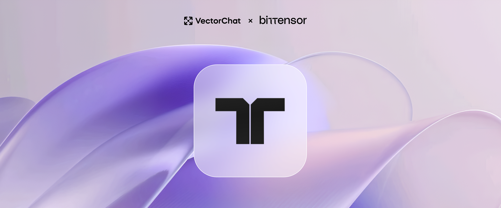

# **The Chunking Subnet** <!-- omit in toc -->
### Intelligent RAG for Intelligent Applications <!-- omit in toc -->

[VectorChat](https://vectorchat.ai) • [Chunking.com](https://chunking.com) • [Toffee](https://medium.com/@vectorchat/introducing-toffee-a-new-era-in-conversational-ai-cfd09c6648ae)

 

# Introduction

Welcome to the Chunking subnet, Subnet 40 on the Bittensor Protocol! This subnet is designed to advance the field of Retrieval-Augmented Generation (RAG) by incentivizing the development and service of sophisticated chunking solutions. Specifically, the subnet aims to create, host, and serve an intelligent chunking solution that maximizes intrachunk similarity and interchunk dissimilarity.

Explore our subnet pitch deck: [placeholder]

Our article on why this is a valuable problem to solve: [The Case for Intelligent Chunking](https://medium.com/@vectorchat/the-case-for-intelligent-chunking-3f903aa3a72c)

Learn more about our project at [vectorchat.ai](https://vectorchat.ai)

## Leading The Way

### *Even from the outset, this subnet will feature the most cutting-edge solutions:*

*Explore our benchmarks and methodology here:* [text-only](https://github.com/VectorChat/text-chunking-benchmarks/blob/main/benchmark.ipynb) and [multimodal](https://github.com/VectorChat/chunking_benchmarks).

### Background

At VectorChat, our mission is to create the most immersive conversational AI experience. Our upcoming platform, [Toffee](https://medium.com/@vectorchat/introducing-toffee-a-new-era-in-conversational-ai-cfd09c6648ae), leverages Retrieval-Augmented Generation (RAG) to offer users seemingly endless memory, conversation length, and domain-specific knowledge.

During the development of Toffee, we found that while many improvements had been made to RAG, chunking had been severely neglected. Existing solutions were either too rudimentary or resource-intensive, making the RAG pipeline both cost-prohibitive and less accurate. Traditional chunking methods (e.g., chunking every X tokens with Y overlap) were cheaper but resulted in higher runtime costs. Unnecessary information was included as context for every LLM query, which is unaffordable when the user base of entertainment apps largely consists of free users and low-cost subscriptions. Conversely, existing semantic chunking solutions, such as Unstructured.io, [were prohibitively expensive and slow](), which would have severely limited the number of files users could upload.

In response, to realize the vision of Toffee, our team had to design an algorithm that significantly outperformed the current offerings by industry leaders. [We achieved this]() not by training proprietary models, but by leveraging the severely underdeveloped state of the field. The necessary information to develop solutions that match or exceed our current model is provided in this documentation.

Our goal is to continue driving down costs, increasing accuracy, and enabling new possibilities. As LLMs begin to use larger and more diverse datasets (e.g., audio, image, video), the importance of intelligent chunking will only grow.

Thus, we designed this subnet to have a straightforward, transparent, and fair incentive mechanism to surpass our own achievements. Explore the [subnet architecture](#architecture) below to learn how responses are evaluated fairly.

We believe the best solutions are yet to come, and we are excited to see how miners can push the boundaries of this technology! 

# Architecture
* ⚖️ [Default Validator](./docs/validator.md)
* ⛏️ [Default Miner](./docs/default_miner.md)
* 💰 [Incentive Mechanism](./docs/incentive_mechanism.md)
* 📝 [Evaluation](./docs/evaluation.md)
* 🧪 [Synthetic Queries](./docs/synthetic.md)
* 🌱 [Organic Queries & the Task API(s)](./docs/organic.md)

# Ethos
### *Models always stay on your machine and remain under your full ownership!*

As mentioned in our [pitch deck](), chunking is an infinitely complex problem that can be approached from countless different avenues. Given sufficiently long, semantically meaningful text, there is no single correct answer, only "more" correct ones. Bittensor is an excellent way to tackle such a problem, as it incentivizes both innovation and fine-tuned optimization to find the most effective solution.

We **do not open-source** the models created, **nor do we ever receive them**. We believe this greatly increases the incentive for developing and/or providing the best solution, as miners retain full ownership of their work.

At the same time, we believe this increases the value brought to the Bittensor protocol, as access to the best chunking model will require a **constant sufficient stake**. Since validators never receive the model, but only the right to serve queries, losing stake in the network also results in losing access to any model produced by the subnet.

# Getting Started

## Helpful Resources
For those new to chunking or Retrieval Augmented Generation (RAG), we strongly recommend you check out our articles here:

* [What is Chunking?](./docs/chunking.md)
* [The Case for Intelligent Chunking](https://medium.com/@vectorchat/the-case-for-intelligent-chunking-3f903aa3a72c)

We also recommend these resources by [Pinecone.io](https://www.pinecone.io/):
* [Retrieval-Augmented Generation](https://www.pinecone.io/learn/retrieval-augmented-generation/)
* [Chunking Strategies for LLM Applications](https://www.pinecone.io/learn/chunking-strategies/)
* [What is a Vector Database?](https://www.pinecone.io/learn/vector-database/)

## Installation

To learn how to set up a miner, see [Default Miner](./docs/default_miner.md). This is a very simple miner to get you started. We highly recommend you read our [Guide to Mining](./docs/miner_guide.md) to create your own logic.

For validator setup and considerations, please view [Validation](./docs/validatior.md).

# Roadmap

Our goal is to establish this subnet as the premier source for the most advanced chunking solution, thereby achieving profitability in the near future.

**Phase 1: Foundation** 
- [ ] Release our opt-in Task API, enabling validators to receive and monetize organic queries.
- [ ] Release framework for validators to create their own Task API network.
- [ ] Launch subnet dashboards for miners and validators, displaying performance, statistics, and tracking compensation.

**Phase 2: Demand**
- [ ] Launch of Chunking.com, our front-end service delivering cutting-edge RAG to developers and enterprises.
- [ ] Launch of Toffee, our conversational AI platform using RAG to create an unparalleled user experience.

**Phase 3: Expansion**
- [ ] Expand to include custom queries and evaluations for structure-dependent data (e.g., CSV).
- [ ] Expand to include new data modalities requiring novel chunking solutions (e.g., image, audio, and video).
- [ ] Advance other areas of Retrieval-Augmented Generation, such as hybrid search.
