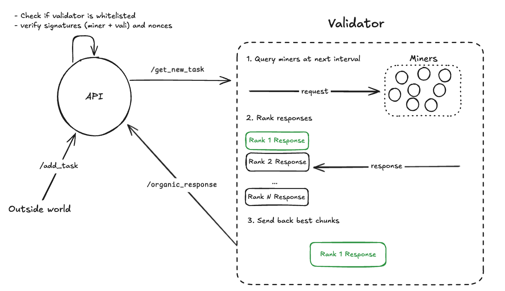

# API Framework Documentation

## Getting Started

The current version of the API framework is located at [`api/main.py`](../api/main.py). This is a simple FastAPI
server implementation that integrates with a validator that accepts organic queries.

### Running the API

Check the args by running:

```bash
python3 api/main.py -h
```

The output should resemble:

```
usage: main.py [-h] [--host HOST] [--port PORT] [--whitelist_hotkeys WHITELIST_HOTKEYS] [--netuid NETUID]
               [--network NETWORK] [--log_level {DEBUG,INFO,WARNING,ERROR,CRITICAL}]

options:
  -h, --help            show this help message and exit
  --host HOST           Host for HTTP server
  --port PORT           Port for HTTP server
  --whitelist_hotkeys WHITELIST_HOTKEYS
                        Validator hotkey addresses to send queries to. Separated by commas. All registered validators
                        are whitelisted by default.
  --netuid NETUID       Netuid for the metagraph
  --network NETWORK     Bittensor network to use ('finney' or 'test' or any websocket endpoint)
  --log_level {DEBUG,INFO,WARNING,ERROR,CRITICAL}
                        Set the logging level
```

Run the API with the following command:

```bash
python3 api/main.py --netuid 40 [other args]
```

The API should now be running on the specified host and port, with the familiar `/docs` endpoint available for viewing the API routes and info via Swagger UI.

### Running your validator

Make sure to set the `CHUNKING_API_HOST` env variable to the host/port of the API server. This is used by the validator to send queries to the API. Also, make sure to set the `--accept_organic_queries` flag when running the validator.

Here's an example:

```bash
CHUNKING_API_HOST='http://127.0.0.1:8080' bash run-validator.sh --accept_organic_queries [other args]
```

## How it works



1. The API server listens for incoming chunking requests via `/add_task`. These are added to a queue in the API server.
2. When a validator accepting organic queries is running, it will call `/get_new_task` before generating a synthetic synapse. This prompts the API server to return the next task in the queue, if the validator hotkey is whitelisted.
3. The validator processes the task and sends the result back to the API server via `/organic_response`.

Current limitations:

- The validator does not currently poll in a separate thread for new tasks.
- The `/add_task` endpoint currently hangs until the task is processed.
