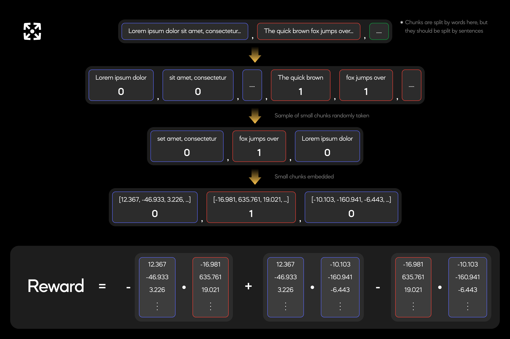

# Reward Function

This subnet incentivizes responses that maximize intrachunk similarity and interchunk dissimilarity, without exceeding variable constraints, such as time or maximum chunk length. This subnet measures similarity by the dot product.

Since the similarity score can be influenced significantly by the content in the provided document, evaluation is always done relatively, within groups of miners that all faced the same query. See [Incentive Mechanism](./incentive_mechanism.md) to learn more.

In the default validator, [reward.py](../chunking/validator/reward.py) rewards the responses of each miner.

## Failure States

### 1. All chunk words present in document

First, the validator confirms that each word in the chunked response also exists, in the same order, in the original document.

https://github.com/VectorChat/chunking_subnet/blob/8c00fd799bfa4d53b2bcaeb1718f76bcfbacfe5d/chunking/validator/reward.py#L73-L138

### 2. Check that all document words can be found in at least one chunk

Then, the validator confirms that every set of 3 adjacent words in the original document is also present within the chunked response.

https://github.com/VectorChat/chunking_subnet/blob/8c00fd799bfa4d53b2bcaeb1718f76bcfbacfe5d/chunking/validator/reward.py#L141-L157

If either don't hold true, the reward is 0.

## Evaluating

After passing the fail states, the validator parses through each chunk, creating 'small chunks' of 3 sentences or fewer.

https://github.com/VectorChat/chunking_subnet/blob/8c00fd799bfa4d53b2bcaeb1718f76bcfbacfe5d/chunking/validator/reward.py#L262-L265

A random sample, of `num_embeddings` size, is taken and then embedded. The default value is 150.

https://github.com/VectorChat/chunking_subnet/blob/8c00fd799bfa4d53b2bcaeb1718f76bcfbacfe5d/chunking/validator/reward.py#L287-L291

Then, to calculate the similarity score, the dot product of every possible pair of embeddings is calculated. The average of each pair originating from the same chunk is added to the score (intrachunk similarity), while the average of each pair originating from different chunks is subtracted from the score (interchunk dissimilarity).

https://github.com/VectorChat/chunking_subnet/blob/8c00fd799bfa4d53b2bcaeb1718f76bcfbacfe5d/chunking/validator/reward.py#L313-L325

Here is a visualization of how the validator calculates a miner’s score:



# Penalties

Finally, penalities are deducted from the reward exponentially.

Responses are penalized exponentially for each character over the maximum chunk length: `chunk_size`

https://github.com/VectorChat/chunking_subnet/blob/8c00fd799bfa4d53b2bcaeb1718f76bcfbacfe5d/chunking/validator/reward.py#L253-L259

And for each chunk over the maximum chunk quantity: `chunk_qty`

https://github.com/VectorChat/chunking_subnet/blob/8c00fd799bfa4d53b2bcaeb1718f76bcfbacfe5d/chunking/validator/reward.py#L237-L243

Validators exponentially penalize responses for each second they are late.

https://github.com/VectorChat/chunking_subnet/blob/8c00fd799bfa4d53b2bcaeb1718f76bcfbacfe5d/chunking/validator/reward.py#L355-L357

The penalties are summed and applied to the reward with the following formula:

```python
reward *= (2/3) ** (summed_penalties)
```
