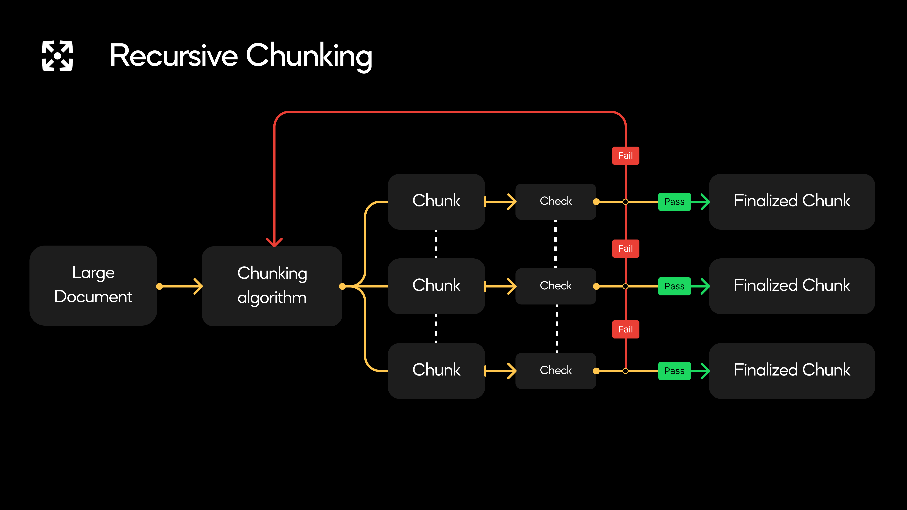
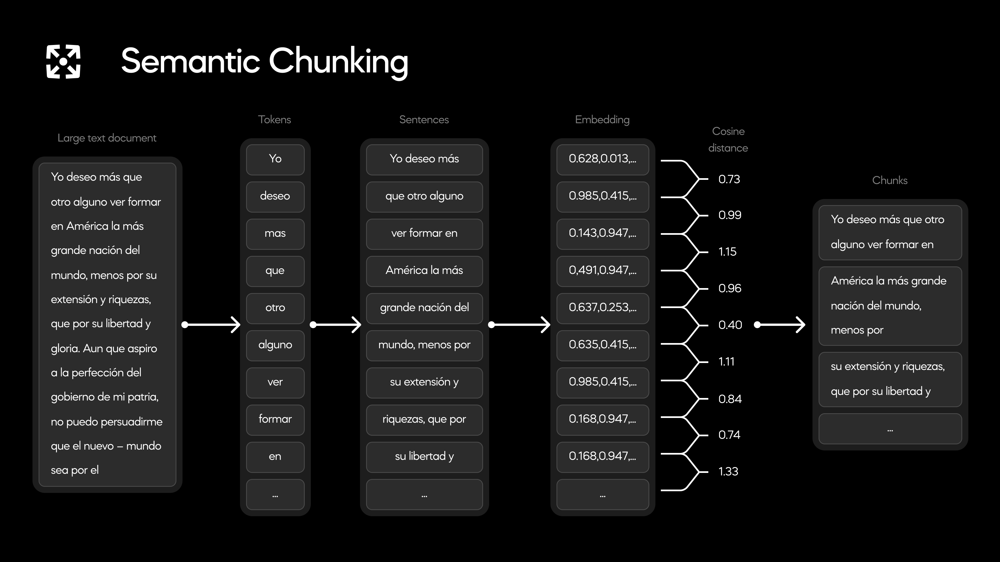

# Tips For How To Improve Your Miner

## Evaluation

First and foremost, we recommend you gain a strong understand of the [Incentive Mechanism](./incentive_mechanism.md) and [Evaluation](./evaluation.md) used by the [default validators](./validation.md), as this is what you are optimizing for.

Especially understand the [Penalties](./evaluation.md/#penalties) section, as these **exponentially** decrease your score.

Validators begin by verifying that the tokens in each chunk correspond to those in the source document. To ensure that your chunks match the source document, it is highly encouraged that you use NLTK's sentence_tokenizer to split the document by sentences before combining them into chunks.

Since this subnet evaluates chunk quality based on the semantic similarity within a given chunk and its dissimilarity to other chunks, **do not overlap or repeat data**. While overlapping chunks is a commonly method in RAG, it comes with many added costs such as increased storage and inference costs, and is therefore not aligned with the goals of this subnet.

## Chunking Strategies

There are various approaches to chunking that can produce high-quality chunks. We recommend that you start by exploring recursive and semantic chunking. To learn more about chunking, we recommend you read this [Pinecone article](https://www.pinecone.io/learn/chunking-strategies/).

### Recursive Chunking

Recursive chunking begins by splitting the data set into a small number of chunks. It then checks whether each chunk meets the desired criteria (such as size or semantic self-similarity.) If a chunk does not meet these criteria, the algorithm recursively splits that chunk into smaller chunks. This process continues until all chunks satisfy the specified criteria.

Here is a diagram of this process:

### Semantic Chunking

Semantic chunking starts by splitting the entire data set into individual sentences. Each sentence, called an anchor sentence, is then grouped with a number of surrounding sentences to form a sentence group. These sentence groups are compared sequentially. A chunk boundary is established wherever the semantic difference between adjacent sentence groups crosses some threshold.

Here is an example with a threshold of 1:

### Prebuilt Solutions

There exist many freely available chunking utilities that can help you get a head start on your chunking algorithm, see the following links:

- [Pinecone's Repo](https://github.com/pinecone-io/examples/tree/master/learn/generation/better-rag)
- [LangChain Text Splitting Documentation](https://js.langchain.com/v0.1/docs/modules/data_connection/document_transformers/)

## Prioritzation & Blacklist

Finally, as the load increases, miners may need to deprioritize or ignore requests from lower-stake validators. Not responding to a request, or taking too long to respond, will result in a score of zero.

By default, miners prioritize requests by stake. Edit the logic in `blacklist()` and `priority()` in [miner.py](../neurons/miner.py) to protect your miner.
