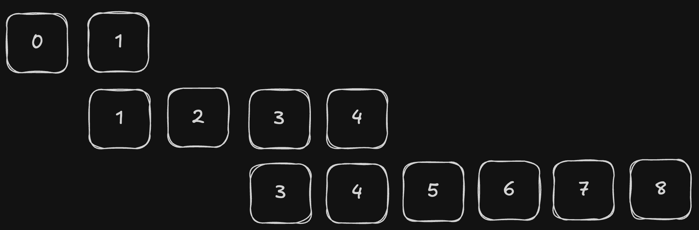
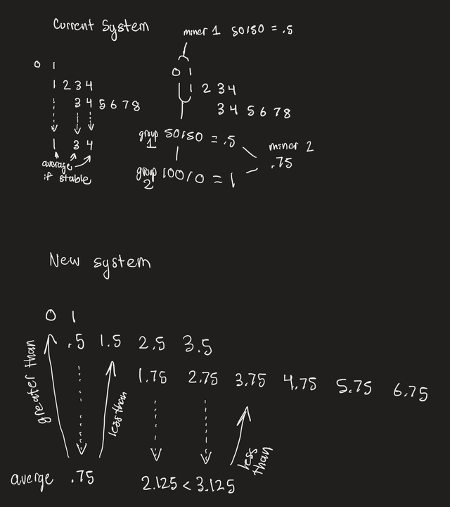
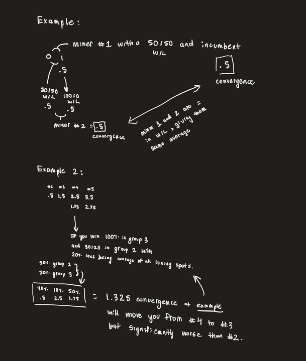

# Improved Ranking

## Issue 1

Due to OpenAI embeddings being non-deterministic there is an non-significant number of rounds where many miners submit the same chunks, but receive slightly different scores. This is an issue because miners who did not technically lose can end up being penalized, hurting their standing in which groups they might overlap into.

### Issue 1 Solution

If multiple miners submit the same chunks, this will only be submitted to the embedding model for grading once, saving validators time and money, all while reducing stochasticity. Currently every group has an alpha value that is used in conjunction with their past score and rank in a round to get a new global score, which is used for deciding which group to place a miner in:

```python
self.scores[uid] = alpha * rank + (1 - alpha) * self.scores[uid]
```

From now on the alpha value, which is get smaller the closer a group gets to rank 0, will also be recursively divided by the amount of miner additional miners that tied with a score. If there are n miners who submitted a solution the forumula for alpha value will be

```python
alpha = alpha_group / (2 ** (n-1))
```

Example: 6 miners labeled from #1 to #6 are in hypothetical group with an alpha value of 0.1. Within this group the starting relative rankings are currently [1,2,3,4,6,5]. The Acme Corporation Validator runs a round with the following scores submitted from the miners:

```txt
Miner 1: 1.05
Miner 2: 1.04
Miner 3: 1.04
Miner 4: 1.09
Miner 5: 1.09
Miner 6: 1.09
```

In this example the rankings for the round that Acme Corporation's Validator would display on [subnet.chunking.com](https://subnet.chunking.com) would be: [4,6,5,1,2,3]

When applying the scoring criteria:

- Miner 1 would be graded with an alpha value of .1
- Miners 2 and 3 would be graded with a .05
- Miners 4,5 and 6 would be graded with a .025

## Issue 2

A good miner will have a hard time climbing ranks because they are always in at least 2 groups at once; Even if they are always ranking first in the lower/worst group it will still negatively affect their score (moving average of rank) by artificially increasing it.

### Issue 2 Explanation

At any point a miner tends to be in 2 groups as all miner groups overlap; This miner will be in one group that is better and one group that is worse. For example: a miner, M, with a rank of 3 will be in group 1 and group 2 (0-indexed). Here's a picture of groups and the corresponding ranks:

<!-- ```txt
0 1 <-- Group 0
1 2 3 4 <-- Group 1
3 4 5 6 7 8 <-- Group 2
``` -->



Group 1 is better because it has miners that are lower ranked and group 2 is worse because it contains miner that are ranked higher (numerically). One issue with this approach is that the miner winning in group 2 actually hurts it's ability to climb ranks in group 1. As an example, let's say the current scores are [0.5, 1.2, 2.3, 2.7]. Our miner, M, has a score of 2.7 and the miner with a rank of 2 has a score of 2.3, and so on. Any win of miner M in group 2 actually ends up hurting it's score, as the best rank miner M can get in group 2 is 3, which is greater than 2.7. This means that, even if miner M wins 100% of the time in group 2, it still hurt's miner M's score.

### Issue 2 Solution

The starting rank value of each miner group should be equal to the average of the rank value of the overlapping index and first index of the better miner group, all other ranks increment by 1 starting from this derived rank:

<!-- ```txt
0 1
0.5 1.5 2.5 3.5
1.75 2.75 3.75 4.75 5.75 6.75
4.125 ...
``` -->


Why? This makes it such that a miner is not penalized by being in 2 groups at once.



## Examples


