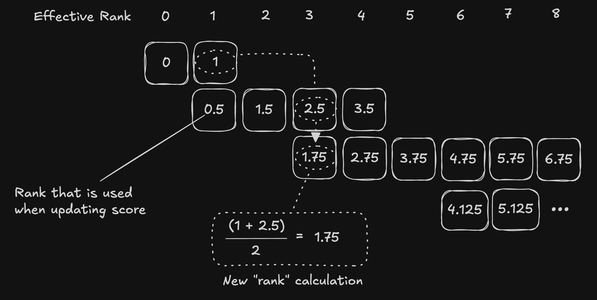

# Ranking System

We use a group tournament ranking system to determine which miners are the best at making optimal chunks according to [our heuristic](./evaluation.md).

Miner's are given weight based on the score determined by this system, a lower score is better.

## How it works

Important terms:

| Term                              | Description                                                                                                                                                                                                                                                                                                                       |
| --------------------------------- | --------------------------------------------------------------------------------------------------------------------------------------------------------------------------------------------------------------------------------------------------------------------------------------------------------------------------------- |
| Global/Absolute/Effective Ranking | The ranking of a miner within the context of all other miners in the validator's touranment                                                                                                                                                                                                                                       |
| Local/Group Ranking               | The ranking of a miner within the context of all other miners in their group                                                                                                                                                                                                                                                      |
| Score                             | The score serves as a moving average of a miner's global/absolute ranking over time. Therefore, the miner with the lowest score is considered (global) rank 0. In the general case, the formula for updating a miner's score is: `new_score = rank_value * alpha + (1 - alpha) * old_score`                                       |
| Rank Value                        | The rank value is the actual value used when updating a miner's score. This value has a special name because it is not just the miner's global ranking that it got within their group for that round. It is formulated such that a miner being in multiple groups is not penalized if they are winning in their lower/worse group |

For a given tournament round, here is how the rank is calculated and the score is updated:

1. Based on the reward value given to each miner, rank all miners locally within their group.
2. Then, find the reward value based on each miner's local rank, accounting for ties properly.
   1. Example: For group 1, if 2 miners tie for first place, they both get a rank value of 0.5. The other 2 miners would get rank values of 2.5 and 3.5 respectively.
3. Now that we have the rank value for each miner, we just need to get the alpha value. The alpha value for a miner is calculated based on the group's index within the tournament, whether the miner got first place, and the number of miners that tied with the miner.
   1. More details can be found in [score.py](../../chunking/utils/score.py)
4. Finally, update the score of each miner based on their rank value and alpha value with the formula: `new_score = rank_value * alpha + (1 - alpha) * old_score`

It can help to visualize:

Each row here represents a different tournament group within a validator's tournament. Each cell represents the rank value a miner would get based on their local ranking within the group for a given tournament round. Similarly, the "Effective Rank" at the top shows the effective/global rank of a miner with respect to all other miners in the validator's tournament for a given tournament round. The effective/global rank was used previously to update the score but was replaced in favor of the rank value in the [improved ranking system](./rank_value.md) to better handle miners in multiple groups.
