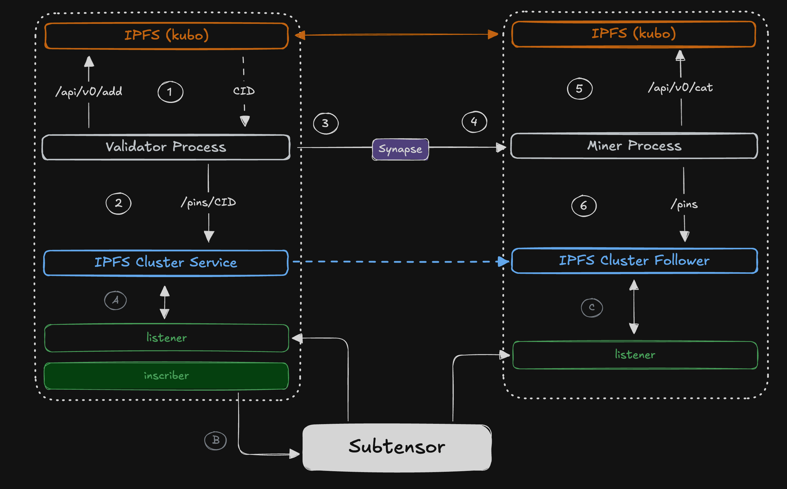

# Architecture

This relay mining mitigation architecture aims to be general and modular, and it runs as a separate component from the normal miner and validator processes. The goal of this relay mining solution is to provide a way for miners to see
all recent validator requests in a tamper-proof and decentralized manner. It uses a combination of cryptography, IPFS, and the Bittensor network to achieve this.

## Overview

Here are the main ideas:

- Use a private IPFS Cluster (with [CRDT consensus](https://en.wikipedia.org/wiki/Conflict-free_replicated_data_type)) to have a shared, persistent, and distributed storage for the validator requests.
  - Validators use the `ipfs-cluster-service` daemon to pin and unpin objects to the IPFS Cluster. Only trusted peers (those that have recently inscribed their IPFS Cluster ID to the chain) are able to pin objects to the IPFS Cluster.
  - Miners use the `ipfs-cluster-follower` (read-only) daemon to have easy access to pinned objects.
- Use the `commitments` pallet to allow validators to "inscribe" their IPFS Cluster ID to the chain via the `set_commitment` call, they send and sign this extrinsic with their hotkey.
- Use cryptographic signatures and hashing to ensure the authenticity of the validator requests
- Use hashing as a first line of defense for miners to filter out duplicate requests
- Use embeddings as a second line of defense to filter out "fuzzy" duplicate requests (i.e. two requests that are almost identical or semantically similar but not exactly the same)
- Only the document hash, embeddings of the document, and a signature are put onto IPFS. The document itself is not added to IPFS.

A validator operator now runs a few extra services, specified via [a docker compose file](../../compose-validator.yml).

| Service         | Description                                                                                                                                                                                                                                                                                                                                                                                                                                                                 |
| --------------- | --------------------------------------------------------------------------------------------------------------------------------------------------------------------------------------------------------------------------------------------------------------------------------------------------------------------------------------------------------------------------------------------------------------------------------------------------------------------------- |
| `val-ipfs`      | A service that runs the IPFS daemon, housing the content fo reach CID                                                                                                                                                                                                                                                                                                                                                                                                       |
| `val-cluster`   | A service that runs an IPFS Cluster daemon with CRDT consensus, used to pin content to the private IPFS cluster                                                                                                                                                                                                                                                                                                                                                             |
| `val-listener`  | A service that listens for inscriptions to the chain. It updates the trusted peers list of the IPFS Cluster daemon as soon as either new inscriptions are detected or old inscriptions expire. This service is important because it keeps the trusted peers list up to date with other IPFS Cluster peers (who are also running this service). This trusted peers list assures only validators who have inscribed to the chain are able to add content to the IPFS Cluster. |
| `val-inscriber` | A service that handles periodically inscribing the validator's IPFS Cluster ID to the chain. This allows it to remain a trusted peer in the IPFS Cluster.                                                                                                                                                                                                                                                                                                                   |

Similarly, a miner operator runs a few extra services, specified via [a docker compose file](../../compose-miner.yml).

| Service          | Description                                                                                                                                                                                                              |
| ---------------- | ------------------------------------------------------------------------------------------------------------------------------------------------------------------------------------------------------------------------ |
| `miner-ipfs`     | A service that runs the IPFS daemon, used to retrieve content from the private IPFS cluster. This is needed because the miner needs access to the content of the requests to compare embeddings.                         |
| `miner-cluster`  | A service that runs the IPFS Cluster follower daemon, used to access the pinned objects in the private IPFS cluster. This is needed because the miner needs to access the content of the requests to compare embeddings. |
| `miner-listener` | A service that listens for inscriptions to the chain and updates the trusted peers list of the IPFS Cluster follower daemon, continually. This ensures the IPFS cluster node stays in sync with the IPFS cluster.        |

## Diagram



### Example Flow
1. The validator creates the special IPFS payload and adds it to IPFS. The IPFS payload has the following structure:

```
{
    "message": {
        "document_hash": "<hash of the document>",
        "embeddings": "<embeddings of the document>"
    },
    "signature": "<signature of the validator>"
}
```

2. The validator takes this IPFS CID and pins it to the IPFS Cluster, with a specified expiry time.
3. The validator will add this CID to the `chunkSynapse` that it sends over to the miner. The `chunkSynapse` will still have all of it's other parameters, including the document itself.
4. The miner will receive the `chunkSynapse`.
5. The miner will check if it can find the CID by using it's local IPFS node (that is bootstrapped with and connected to the private IPFS network)
6. If the miner finds the CID, it will then check it's list it's pins to look for exact or fuzzy duplicates in recent requests. Exact duplicates are found by checking the `document_hash`. Fuzzy duplicates are found by comparing the cosine similarity between the request document embeddings and the existing pinned document embeddings; a request is deemed a fuzzy duplicate if the cosine similarity is greater than a predefined threshold (configurable via the miner using `--neuron.relay_embed_threshold`).

### Background Components

<ol type="A">
<li>The `listener` service continually updates the trusted peers list of the IPFS Cluster daemon by subscribing to finalized blocks on the chain and keeping track of the latest inscriptions (and whether or not they are expired).</li>
<li>The `inscriber` service is responsible for inscribing the validator's IPFS Cluster ID to the chain continually, respecting predefined rate limits of the extrinsic (currently every 100 blocks). This service ensures the validator stays trusted by other IPFS Cluster peers in the network.</li>
<li>The `listener` service is required on the miner machine to ensure the trusted peers list stays up to date. The `listener` service subscribes to the same chain as the `inscriber` service, and the trusted peers list is updated accordingly.</li>
</ol>

