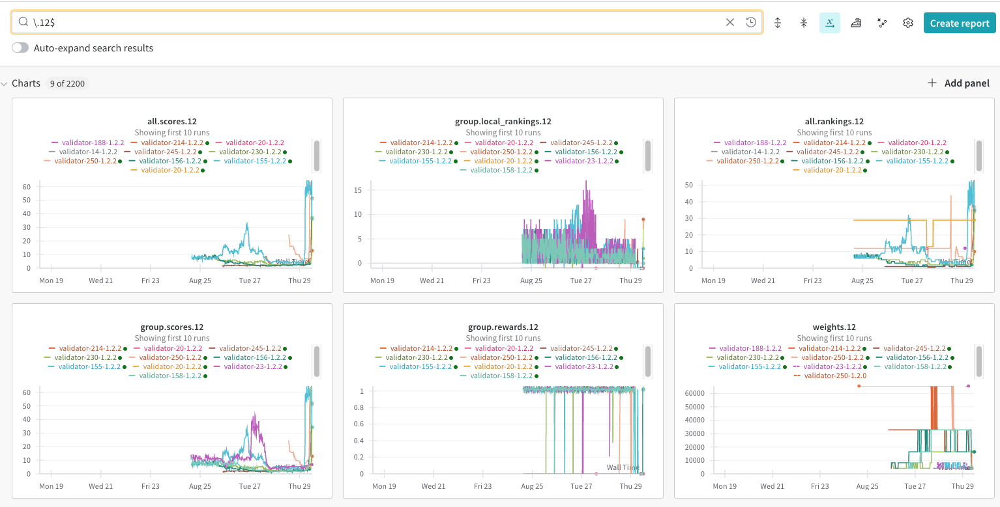

# How to read the W&B guide

Each chart in the W&B is for a _specific_ miner. 

If you want to look for charts that apply to only your miner, a regex of the form `\.<YOUR_UID>$` can be used to filter the charts. 
Example: `\.12$` or `weights.12$`. 

A similar regex can be used for multiple miners: `\.\(<UID_1>|<UID_2>|<...>\)$`, an example being: `\.\(10|11)$` 

Each line on the chart is the logs from a specific validator for that miner.

Here are the main metrics that are logged to W&B:

| Metric                 | Description                                                                                                                                                                                           |
| ---------------------- | ----------------------------------------------------------------------------------------------------------------------------------------------------------------------------------------------------- |
| `weights`              | The weights that the validator would set at the time of logging (does not necessarily mean they set these weights)                                                                                    |
| `all.rankings`         | New updated rankings for all miners after the tournament round                                                                                                                                        |
| `all.scores`           | New updated moving average rankings for all miners after the tournament round. This value is what is referenced when settings weights. A lower score is better                                        |
| `group.process_times`  | The process time for each miner in the group for that tournament round in seconds                                                                                                                     |
| `group.rewards`        | The individual rewards for each miner in the group for that tournament round. This reward is used to calculate the rankings within the miner group.                                                   |
| `group.local_rankings` | The rankings within the miner group for that tournament round                                                                                                                                         |
| `group.all_rankings`   | The rankings within the miner group for that tournament round, but offset to what the weights would be in a global context (e.e., rank 0 in miner a miner group starting at rank 13 would be rank 13) |
